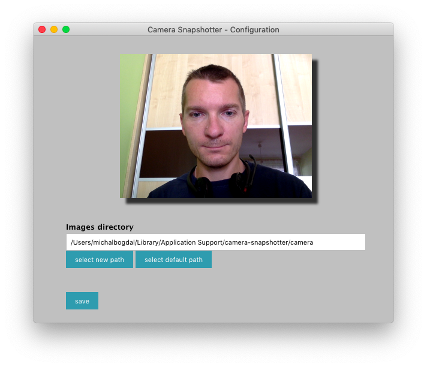

**Camera Snapshotter**

Simple application in **Electron** and **WebcamJS** to take snapshots from camera and persist in the disk. 
Application is mainly created for integrating with another ***"Do not Disturb"*** application.
https://digitasecurity.com/donotdisturb/
allowing to make camera snapshots and saving them when macbook lid is opened.

Application is taking 2 photos (one after 1 sec, another after 5sec) and store in a defined path, which by default could be */Users/michalbogdal/Library/Application Support/camera-snapshotter/camera*


# Configuration
If application is executed with parameter "-config" we will see window where we can change default path for stored images.

```
npm run start-config
```
or native macosx app
```
open camera-snapshotter.app --args -config
```

All settings are stored using ***electron-settings*** module which saves config in */Users/michalbogdal/Library/Application Support/camera-snapshotter/Settings*

Configuration window



# Building and running

```
npm install
npm start
npm run start-config
```

for native packages
```
npm run electron-build
```

in "Do Not Disturb" application we can configure "execute action" as:
```
open /Applications/camera-snapshotter.app
```
